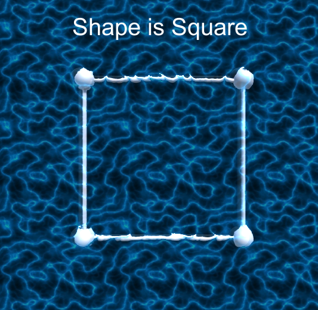
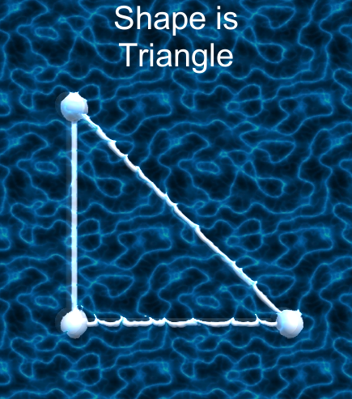
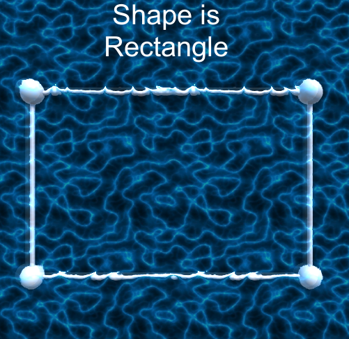
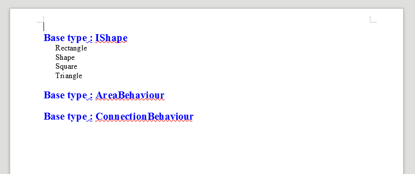

# Reflection-Shapes

# 1. Detecting shapes

Detecting shapes which are implemented in application. After adding new shape application detects it.

Class **AreaBehaviour**

# 2. Documentation export

Export documentation to .docx file. Appication checks every class and interface in project. 

Class **DocumentationExport**

